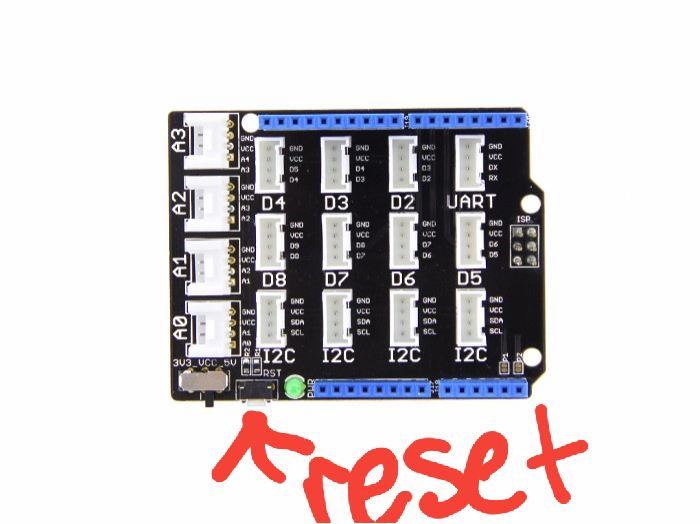

# Tide-Pool
**This repository contains the code to run the tide pool
for the marine lab biology group.**

This code controls the pumping system for both the tide pool and the stingray
lagoon. There are currently two pumps that when one is on, it empties the tank
it is in filling the other tank.

Currently, the tide pool and lagoon oscillate between high and low tide every six and a half hours. The system wants the tide pool to be at high tide when the lagoon is at low tide and vice versa. When the [arduino program](TidePoolLCD/TidePoolLCD.ino) starts, the tide pool fills with water from the lagoon. This filling by turning the pump on for five minutes and then turning it off for the next five minutes repeats until the high tide sensor is triggered. If for some reason the water level decreases, the pump will fill again until the high tide sensor is on. After six and a half hours passed, the system then will pump water from the tide pool into the lagoon until the tide pool's low tide sensor is triggered. After six and a half hours pass, the pump to fill the tide pool turns on and this tidal system repeats.

This system is connected to hardware that connects it to Wi-Fi called the Adafruit Huzzah ESP8266 Breakout Board. This system gets the height values from the ultrasonic sensor that the Arduino records. These values are then sent to Adafruit io, a free online tool. The levels are recorded every three seconds and are kept for a month and can be found at [Adafruit IO Online Dashboard](https://io.adafruit.com/anonymousAlligator/dashboards/ultrasonicsensordashboard). If the Arduino stops, the data isn't sent to Adafruit io and an email notification is sent within 30 minutes.

The schematic for the current system looks like the below image:

**Soon to be implemented** the tidal data will be pulled from online and will mimic the tidal predictions from Kiptopeke, VA.

## Components
**SunFounder 2 Channel Relay**

The relay allows the Arduino Uno to switch the pumps on and off as necessary.  The Arduino is a low voltage and low amperage system and cannot supply enough power to operate the pumps.  The relay functions like a switch and you should hear a “click” when a pump switches on or off, which also turn one of two red lights located on the rear of the device.
[*URL*](http://www.amazon.com/SunFounder-Channel-Shield-Arduino-Raspberry/dp/B00E0NTPP4/ref=sr_1_2?ie=UTF8&qid=1436551285&sr=8-2&keywords=relay+arduino)

The Arduino and the relay should be connected as follows:

|Arduino	| Relay |
|---------|-------|
| GND	    | GND   |
| 5V	    |	VCC   |
| 11    	| IN1   |
|12	      | IN2   |

**Arduino Uno - Microcontroller**

The Arduino acts like the brain of the system.  It talks to the relay to turn the pumps on and off based on the code that is programmed into the controller.  Only 14 of the pins (labeled: GND, 5V, 3.3V, 2, 3, 4, 5, 6, 7, 8, 9, 10, 11, and 12) should be in use.
The USB cord is used to upload code from a computer to the Arduino and may remain connected to the board.  The last connection to the board is the power supply (looks similar to a phone charger), which will have to power the Arduino at all, time and the charger should have a red light to indicate that it is on.  The Arduino should have a green light to indicate that it is receiving power that is located on the opposite side as the USB port.
[*URL*](http://www.amazon.com/Atmega328p-Atmega16u2-Version-Board-Arduino/dp/B00SF28U7A/ref=sr_1_8?ie=UTF8&qid=1436553628&sr=8-8&keywords=arduino)

**Grove Seeed RGB LCD**

This LCD (Liquid Crystal Display) shows the system’s current state—filling or draining. It also shows whether the high or low tide bobbers are triggered. If the bobbers are both triggered, the system is in an error state.
[*URL*](http://wiki.seeedstudio.com/Grove-LCD_RGB_Backlight/)

**Grove Seeed Base Shield V2**

This shield allows the RGB LCD to easily communicate with the Arduino.
[*URL*](http://wiki.seeedstudio.com/Base_Shield_V2/)

**Ultrasonic Sensor HC-SR04**

This sensor can read the exact water level. This sensor reads in the exact tidal level. This sensor sends the tidal level readings to the Wi-Fi ESP8266 chip.
[*URL*](https://www.sparkfun.com/products/13959)

**Bi-directional Logic Converter**

This chip converts the Arduino’s 5 Volt digital output pins to a 3 Volt level able to be read by the Wi-Fi chip. This is because the Wi-Fi chip operates on a 3 Volt logic level, while the Arduino operates on a 5 Volt logic level. If the Arduino is incorrectly connected to the Wi-Fi chip without the logic converter, the Wi-Fi chip could break.
[*URL*](https://www.sparkfun.com/products/12009)

**Wi-Fi Chip (Adafruit ESP8266 Huzzah Breakout Board)**

This chip is connected to a wireless network. This enables the project to send the tidal readings to an online source. The current online source the tidal data is pushed to is Adafruit io. This online source accepts data every three seconds, and will send an email after thirty minutes if the system is halted. This chip gets readings from the Arduino via a serial connection on pin 12 (receiving RX) and pin 13 (transmitting TX) and sends that information to the Adafruit io system to be logged for a month.
[*URL*](https://learn.adafruit.com/adafruit-huzzah-esp8266-breakout/overview)

**High Tide Switch/Bobber**

This switch tells whether the tide is high or low. This bobber switches the fill pump off after the pump has been on for the minimum five-minute time.
[*URL*](https://www.amazon.com/uxcell-Pieces-ZP4510-Vertical-Switches/dp/B00FHAEBIA/ref=sr_1_2?ie=UTF8&qid=1529595162&sr=8-2&keywords=arduino+float+switch)

**Low Tide Switch/Bobber**

This switch tells whether the tide is high or low. This bobber switches the drain pump off after the pump has been on for the minimum five-minute time.
[*URL*](https://www.amazon.com/uxcell-Pieces-ZP4510-Vertical-Switches/dp/B00FHAEBIA/ref=sr_1_2?ie=UTF8&qid=1529595162&sr=8-2&keywords=arduino+float+switch)

**Saltwater Pump (2)**

These two pumps do not operate at the same head and the head “velocity” will very over time between the two they pump at different rates.  These pumps are connected to an outlet, which turns on the pumps through the relay. This means that even though the pumps may look like they are plugged in, the outlet may be “off”.
[*URL*](https://www.drsfostersmith.com/product/prod_display.cfm?c=3578+4587+21413&pcatid=21413)

**Waterproof Hobby Box**

This is a box that keeps the electrical components dry.  There were some issues (minor shock) due to the hobby box not being waterproof and corrosive saltwater vapor.  Make sure that if the box is opened that the cords that are fed into the box rest between the jell sealant and that the box clasps are properly fastened.  If a replacement is needed make sure to purchase a large one.
[*URL*](http://www.amazon.com/Weatherproof-Outdoor-Electrical-Connection-Enclosure/dp/B006EUHRK6/ref=sr_1_fkmr3_1?ie=UTF8&qid=1431288296&sr=8-1-fkmr3&keywords=waterproof+electrical+hobby+box)

## Code:
The code has two components:
1. [The  Arduino part that controls the motors](https://github.com/meyerpa/Tide-Pool/blob/master/TidePoolLCD/TidePoolLCD.ino)
2. [The Wi-Fi Chip Part that uploads the tidal level](https://github.com/meyerpa/Tide-Pool/tree/master/ESP8266)

The Arduino is running this current code.

## Code Discussion:
The code requires input from sensors. There are two sensors to detect extreme tidal level. One sensor detects high tide and the other sensor detects low tide. The tide switches from high to low and vice versa every 6.5 hours.

The Arduino controls the pumps through a relay. The Arduino will either be in a state of filling or draining the tide pool. The fill and drain will continue until the high or low tide sensors are toggled, respectively. When the tide pool is filling, the fill pump will either be one or off. The pump is initially off for five minutes and then will turn on for the next five minutes. The following five minutes the pump will be off. This pattern continues until the high tide bobber is toggled on. AA similar pattern happen with the drain pump until the low tide bobber is toggled on.

This system functions by itself filling and draining the tide pool. But there is an additional system to send the tide level online, so the system can be monitored. This additional system has a ultrasonic sensor to detect the exact water (tidal) level. This sensor observes the tidal level and sends the level online by serially communicating to the wI-fi chip which sends the level to the [Adafruit IO Online Feed](https://io.adafruit.com/anonymousAlligator/feeds/ultrasonicsensor).

## Maintenance & System Care

This current setup is a system that requires input from the ultrasonic sensor, high tide bobber, and low tide bobber. This system will repeat indefinitely without intervention.  The electronics require a dry environment and should be kept out of water vapor.  If the system needs to be recalibrated or reset due to an error, there is a reset button that is located on the Arduino board in the corner.

**Simply turning the system off and back off again resets the code and is a good way of fixing most issues.**

For high and low tide sensor issues, clean off the bobbers.

For bad or no ultrasonic sensor readings, try switching out the ultrasonic sensor, as this may get corroded due to the environment. If that doesn’t fix the issue, try resetting the Arduino.

### For any questions please contact:
[Dr. Steve Lindaas](mailto:lindaas@mnstate.edu),
[Paige Meyer](mailto:paigemey7@gmail.com), or
[Benjamin LeMay](benjaminlemay@protonmail.com)
